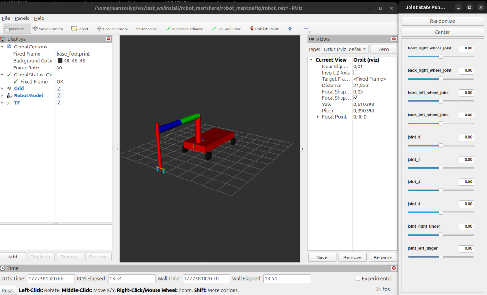

# robot msr


[](https://github.com/docencia-juanscelyg/robot_msr/actions/workflows/jazzy.yaml)

Este paquete contiene una muestra de la configuración necesaria para la parte A (verificación de los joints y su configuración) de la práctica 3 de Modelado y Simulación de Robots de  GIRS en la URJC. Es un robot básico con un manipulador.



## Configuración

```bash
cd <workspace>/src
git clone https://github.com/docencia-juanscelyg/robot_msr.git
cd <workspace>
rosdep install --from-paths src --ignore-src -r -y
colcon build --symlink-install 
source install/setup.bash
```

## Uso

```bash
ros2 launch robot_msr robot_check.launch.py
```
